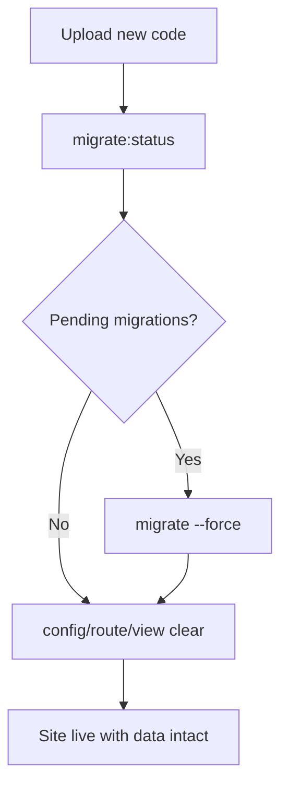

# cPanel deployment — terminal command reference

Kibondo on shared cPanel: Laravel app in `kibondo_store/`, web root at  
`public_html/store.kibondogreenfarm.co.tz/`. Requires **PHP 8.3+** and **PostgreSQL 13+**.

Set these once per SSH session:

```bash
export APP_ROOT=/home/kibondogreenfarm/kibondo_store
export WEB_ROOT=/home/kibondogreenfarm/public_html/store.kibondogreenfarm.co.tz
export PHP=/opt/cpanel/ea-php83/root/usr/bin/php

cd "$APP_ROOT"
alias php="$PHP"
php -v   # must be 8.3.x
```

If `ea-php83` is missing: `ls /opt/cpanel/ea-php*/root/usr/bin/php` and pick 8.3+.

---

## Folder layout

```text
/home/kibondogreenfarm/
├── kibondo_store/          ← artisan, .env, vendor, storage
└── public_html/
    └── store.kibondogreenfarm.co.tz/   ← index.php, .htaccess, build/
```

`index.php` in `WEB_ROOT` must load the app from `kibondo_store`:

```php
require __DIR__.'/../../kibondo_store/vendor/autoload.php';
$app = require_once __DIR__.'/../../kibondo_store/bootstrap/app.php';
```

(Full file: copy from `kibondo_store/public/index.php` and fix the two paths above.)

---

## Initial server setup

### Permissions

```bash
chmod -R 775 "$APP_ROOT/storage" "$APP_ROOT/bootstrap/cache"
```

### Storage link (uploads / product images)

```bash
rm -rf "$WEB_ROOT/storage"
ln -s ../../kibondo_store/storage/app/public "$WEB_ROOT/storage"
ls -la "$WEB_ROOT/storage"
```

### Ensure `.htaccess` exists in web root

```bash
test -f "$WEB_ROOT/.htaccess" || cp "$APP_ROOT/public/.htaccess" "$WEB_ROOT/.htaccess"
```

Required for `/sanctum/csrf-cookie` and `/api/v1/*`.

### Environment file

```bash
# Edit production settings
nano "$APP_ROOT/.env"
```

Minimum:

```env
APP_ENV=production
APP_DEBUG=false
APP_URL=https://store.kibondogreenfarm.co.tz
DB_CONNECTION=pgsql
DB_HOST=localhost
DB_DATABASE=...
DB_USERNAME=...
DB_PASSWORD=...
SANCTUM_STATEFUL_DOMAINS=store.kibondogreenfarm.co.tz
SESSION_DOMAIN=.kibondogreenfarm.co.tz
SESSION_SECURE_COOKIE=true
```

---

## Database

### Migrations without losing data

`php artisan migrate` only applies **new** migration files that are not yet recorded in the `migrations` table. It changes **schema** (tables, columns, indexes). It does **not** delete rows in `users`, `sales`, `products`, or other data tables.

Use this on production after every code deploy that includes new files under `database/migrations/`:

```bash
cd "$APP_ROOT"

# Optional: confirm DB connection and pending migrations
php artisan migrate:status

# Safe: run only pending migrations (non-interactive in production)
php artisan migrate --force

# Optional: verify row counts were not wiped
php artisan tinker --execute="echo 'users: '.\DB::table('users')->count().\"\n\";"
```

**Safe commands (keep existing data)**

| Command | What it does |
|---------|----------------|
| `php artisan migrate --force` | Runs pending migrations only |
| `php artisan migrate:status` | Lists applied vs pending migrations |
| `php artisan db:seed --class=SomeSeeder --force` | Inserts/updates seed data (only if you intend to) |

**Never on production (wipes or replaces data)**

| Command / action | Why |
|------------------|-----|
| `php artisan migrate:fresh` | Drops all tables, re-runs all migrations — **all data gone** |
| `php artisan migrate:fresh --seed` | Same as above, then seeds |
| `php artisan migrate:refresh` | Rolls back all migrations, then re-runs — **data loss** |
| `php artisan migrate:reset` | Rolls back all migrations — **data loss** |
| `php artisan db:wipe` | Drops all tables |
| `DROP SCHEMA public CASCADE` in SQL | Removes every table and row |
| Re-importing a full SQL dump over an existing DB | Replaces data unless you use a careful partial import |

**Why staff admin “disappeared”**

Migrations did not delete the admin. The user row was lost because the database was **reset** (fresh migrate, schema drop, or import into an empty DB) without re-creating the admin. Production does not auto-run `AdminUserSeeder` unless you run `db:seed` (see [Staff admin user](#staff-admin-user)).

**First-time database — pick one path**

| Path | When | Steps |
|------|------|--------|
| **A — Import SQL** | You have a dump from Docker (`export-database-cpanel.sh`) | Import in phpPgAdmin/psql → fix [GRANTs](#fix-table-permissions-after-sql-import) → run `migrate --force` only for migrations **newer** than the dump |
| **B — Empty DB** | No dump; brand-new database | `migrate --force` → create admin via [tinker](#staff-admin-user) → optional `db:seed` for categories/settings |

After path A or B, **updates** are always: upload code → `php artisan migrate --force` → clear caches (see [Deploy code updates](#deploy-code-updates)).



### Import from local Docker (on your PC)

```bash
# On PC — produces deploy/kibondo_database_cpanel.sql
./deploy/export-database-cpanel.sh
# Upload SQL to server, then in psql or phpPgAdmin import into cPanel DB
```

### Fix table permissions after SQL import

If the app user cannot read tables (`permission denied for migrations`):

```sql
GRANT USAGE ON SCHEMA public TO your_db_user;
GRANT ALL PRIVILEGES ON ALL TABLES IN SCHEMA public TO your_db_user;
GRANT ALL PRIVILEGES ON ALL SEQUENCES IN SCHEMA public TO your_db_user;
```

Run in phpPgAdmin **SQL** tab (not inside a `SELECT`).

### Verify database

```bash
php artisan tinker --execute="echo \DB::table('migrations')->count().\" migrations\n\";"
```

---

## Staff admin user

```bash
cd "$APP_ROOT"
php artisan tinker --execute="
\App\Models\User::updateOrCreate(
    ['email' => 'admin@kibondogreenfarm.co.tz'],
    [
        'name' => 'System Admin',
        'phone' => '+255700000000',
        'password' => 'your-secure-password',
        'role' => 'admin',
        'is_active' => true,
    ]
);
echo \"Admin ready\n\";
"
```

Login: `https://store.kibondogreenfarm.co.tz/`  
Roles: `admin`, `sales`, `stock_manager`, `accountant`.

---

## Laravel maintenance

```bash
cd "$APP_ROOT"

# Clear caches (after .env or code changes)
php artisan config:clear
php artisan route:clear
php artisan view:clear
php artisan cache:clear

# List routes (debug 404 on sanctum)
php artisan route:list --path=sanctum

# Application key (only once)
php artisan key:generate --show

# Storage link (if using default public/ as web root — optional here)
php artisan storage:link
```

Do **not** run `config:cache` on cPanel unless you know paths are correct.

---

## Cron (scheduler + queue)

```bash
crontab -e
```

Add (use `$PHP` path):

```cron
* * * * * cd /home/kibondogreenfarm/kibondo_store && /opt/cpanel/ea-php83/root/usr/bin/php artisan schedule:run >> /dev/null 2>&1
*/2 * * * * cd /home/kibondogreenfarm/kibondo_store && /opt/cpanel/ea-php83/root/usr/bin/php artisan queue:work --stop-when-empty --max-time=110 >> /dev/null 2>&1
```

---

## Upload zip from your PC (recommended if server build fails)

Build locally, zip, upload via **File Manager** or **SFTP** — no Node/Composer on the server required.

### On your PC

```bash
cd /path/to/Kibondo
chmod +x deploy/package-cpanel.sh
./deploy/package-cpanel.sh
```

Creates `deploy/kibondo-cpanel-YYYYMMDD-HHMM.zip` containing `vendor/`, `public/build/`, and app code (no `.env`, no `node_modules`).

Requires **Docker** (for Composer with PHP 8.3) or local Composer 8.3 + Node 20+.

Re-zip only (already built):

```bash
./deploy/package-cpanel.sh --skip-build
```

### Upload

1. cPanel → **File Manager** (or SFTP).
2. Upload the zip to e.g. `/home/kibondogreenfarm/`.
3. **Backup** the live app folder and `.env` before replacing files.

### On server after upload

```bash
export APP_ROOT=/home/kibondogreenfarm/Kibondo
export WEB_ROOT=/home/kibondogreenfarm/public_html/store.kibondogreenfarm.co.tz
export PHP=/opt/cpanel/ea-php83/root/usr/bin/php

# Backup .env
cp "$APP_ROOT/.env" /home/kibondogreenfarm/.env.backup.$(date +%Y%m%d) 2>/dev/null || true

# Extract (adjust zip path/name)
cd /home/kibondogreenfarm
unzip -o kibondo-cpanel-*.zip
# Zip contains top folder kibondo/ — either:
rsync -a kibondo/ "$APP_ROOT/"
# or extract directly into APP_ROOT if you renamed the folder

# Restore .env if the zip overwrote it
# cp /home/kibondogreenfarm/.env.backup.YYYYMMDD "$APP_ROOT/.env"

# Frontend assets → subdomain web root
rsync -a --delete "$APP_ROOT/public/build/" "$WEB_ROOT/build/"
for f in favicon.svg icon-192.png apple-touch-icon.png manifest.json robots.txt; do
  [[ -f "$APP_ROOT/public/$f" ]] && cp -f "$APP_ROOT/public/$f" "$WEB_ROOT/$f"
done

chmod -R 775 "$APP_ROOT/storage" "$APP_ROOT/bootstrap/cache"

cd "$APP_ROOT"
$PHP artisan migrate --force
$PHP artisan config:clear
$PHP artisan route:clear
$PHP artisan view:clear
```

**Never upload** `.env` inside the zip — keep production secrets only on the server.

First-time: also set [storage symlink](#storage-link-uploads--product-images), `index.php` in `WEB_ROOT`, and [cron](#cron-scheduler--queue).

---

## Build on server after `git pull`

Use this when the repo is cloned on cPanel and you deploy with **Terminal + git**, not zip upload.

### One-time prerequisites

1. **Git clone** into `APP_ROOT` (private dir, not web-accessible):

   ```bash
   cd /home/kibondogreenfarm
   git clone <your-repo-url> kibondo_store
   cd kibondo_store
   cp .env.example .env   # then edit .env for production (DB, APP_URL, mail, etc.)
   php artisan key:generate
   ```

2. **Node.js 20+** — cPanel → **Software** → **Setup Node.js App** (or use EA Node):

   ```bash
   ls /opt/cpanel/ea-nodejs*/bin/node
   export PATH=/opt/cpanel/ea-nodejs22/bin:$PATH   # pick highest 20+ you have
   node -v   # v20.x or v22.x
   ```

3. **PHP 8.3 extensions** — required for Composer and Firebase:

   cPanel → **Software** → **Select PHP Version** (or **MultiPHP INI Editor**) → choose **PHP 8.3** → **Extensions** → enable at least:

   `sodium`, `pdo_pgsql`, `pgsql`, `mbstring`, `curl`, `openssl`, `fileinfo`, `bcmath`, `zip`, `intl` (recommended)

   Verify in Terminal (CLI must show `sodium` too):

   ```bash
   /opt/cpanel/ea-php83/root/usr/bin/php -m | grep -E 'sodium|pdo_pgsql'
   ```

   If **sodium** is not in the Extensions list, ask the host to install **`ea-php83-php-sodium`** (EasyApache 4). Do **not** use `composer update` or `--ignore-platform-req=ext-sodium` on production — Firebase JWT needs real sodium.

4. **Composer** — the build script downloads `composer.phar` and runs it with PHP 8.3 (`composer` alone is often missing or uses PHP 8.2).

5. **`.env`** — never commit; keep on server only. `git pull` must not overwrite it (`git update-index --assume-unchanged .env` optional if tracked by mistake).

6. **Web root** — `index.php`, `.htaccess`, [storage symlink](#storage-link-uploads--product-images) as in [Folder layout](#folder-layout).

### Every deploy

```bash
export APP_ROOT=/home/kibondogreenfarm/kibondo_store
export WEB_ROOT=/home/kibondogreenfarm/public_html/store.kibondogreenfarm.co.tz
export PHP=/opt/cpanel/ea-php83/root/usr/bin/php
# If node not in PATH:
# export PATH=/opt/cpanel/ea-nodejs22/bin:$PATH

cd "$APP_ROOT"
git pull

chmod +x deploy/build-cpanel.sh
./deploy/build-cpanel.sh
```

The script runs:

- `composer install --no-dev --optimize-autoloader` (PHP 8.3 platform in `composer.json`)
- `npm ci` + `npm run build` → `public/build/`
- `rsync` of `public/build/` → `$WEB_ROOT/build/`
- `config:clear`, `route:clear`, `view:clear`

Then apply DB changes if any:

```bash
php artisan migrate --force
```

### Manual build (without script)

```bash
cd "$APP_ROOT"
export PATH=/opt/cpanel/ea-nodejs22/bin:$PATH

$PHP -d allow_url_fopen=On composer.phar install --no-dev --optimize-autoloader --no-interaction
npm ci
npm run build
rsync -a --delete public/build/ "$WEB_ROOT/build/"
$PHP artisan config:clear && $PHP artisan route:clear && $PHP artisan view:clear
php artisan migrate --force
```

### Troubleshooting server builds

| Problem | Fix |
|---------|-----|
| `node: command not found` | Setup Node.js App or `export PATH=/opt/cpanel/ea-nodejs22/bin:$PATH` |
| `npm run build` killed / heap | `export NODE_OPTIONS=--max-old-space-size=2048` then retry |
| Composer PHP version error | Use `$PHP` = `ea-php83`, not default `php` 8.2 |
| `allow_url_fopen` / Composer installer fails | Script uses `curl` for `composer.phar` + `php -d allow_url_fopen=On`; or run: `$PHP -d allow_url_fopen=On composer.phar install ...` |
| `ext-sodium` missing / lock file incompatible | Enable **sodium** for PHP 8.3 in cPanel Extensions; verify with `$PHP -m \| grep sodium`. Do not run `composer update` on server. |
| `composer: command not found` | Use `$PHP -d allow_url_fopen=On composer.phar install` (script creates `composer.phar` in app root) |
| Site loads but no CSS/JS | Missing `$WEB_ROOT/build/` — run script or `rsync` build folder |
| `git pull` conflicts | `git stash` local changes, pull, `git stash pop`; never stash `.env` secrets carelessly |

---

## Deploy code updates

After [building on server](#build-on-server-after-git-pull) (or uploading a pre-built zip), run migrations only when needed (see [Migrations without losing data](#migrations-without-losing-data)):

```bash
cd "$APP_ROOT"
php artisan migrate:status    # optional
php artisan migrate --force
```

Do **not** use `migrate:fresh`, `migrate:refresh`, or `db:wipe` on a live store.

**Alternative:** [Upload zip from your PC](#upload-zip-from-your-pc-recommended-if-server-build-fails) (`./deploy/package-cpanel.sh`).

---

## Local PC — other commands

```bash
# Full deploy zip for cPanel
./deploy/package-cpanel.sh

# Database dump for phpPgAdmin import
./deploy/export-database-cpanel.sh
```

---

## Troubleshooting

| Problem | Command / check |
|---------|------------------|
| Composer “requires PHP >= 8.3” | Use `$PHP` = `ea-php83`, not default `php` |
| 404 on `/sanctum/csrf-cookie` | `test -f "$WEB_ROOT/.htaccess"`; `php artisan route:list --path=sanctum` |
| 500 after DB import | GRANT privileges; read `tail -30 storage/logs/laravel.log` |
| Admin missing after deploy | You reset DB or never seeded; use [Staff admin user](#staff-admin-user) — not caused by `migrate --force` |
| Login / CSRF fails | `.env` `APP_URL`, `SANCTUM_STATEFUL_DOMAINS`, `SESSION_DOMAIN` |
| Images 404 | `ls -la "$WEB_ROOT/storage"` → symlink to `storage/app/public` |

```bash
tail -30 "$APP_ROOT/storage/logs/laravel.log"
```

### Remove old one-time debug files (if uploaded earlier)

```bash
rm -f "$WEB_ROOT/cpanel-check.php" "$WEB_ROOT/cpanel-create-admin.php"
```

---

## URLs

| URL | Purpose |
|-----|---------|
| `https://store.kibondogreenfarm.co.tz/` | Staff dashboard |
| `https://store.kibondogreenfarm.co.tz/store` | Customer storefront |
| `https://store.kibondogreenfarm.co.tz/sanctum/csrf-cookie` | Should not 404 (empty/204) |

---

## Related files in `deploy/`

| File | Purpose |
|------|---------|
| `package-cpanel.sh` | Build locally + zip for manual upload (run on PC) |
| `build-cpanel.sh` | `composer` + `npm run build` + sync `build/` to web root (run on server) |
| `export-database-cpanel.sh` | Export PG 13 SQL dump from Docker (run on PC) |
| `crontab.txt` | Cron comment reference |
| `supervisor-worker.conf` | VPS/Docker queue worker (not cPanel) |
| `pgbouncer.ini` | VPS connection pooling (not cPanel) |

VPS/Docker production: see [DEPLOYMENT.md](../DEPLOYMENT.md) in the repo root.
